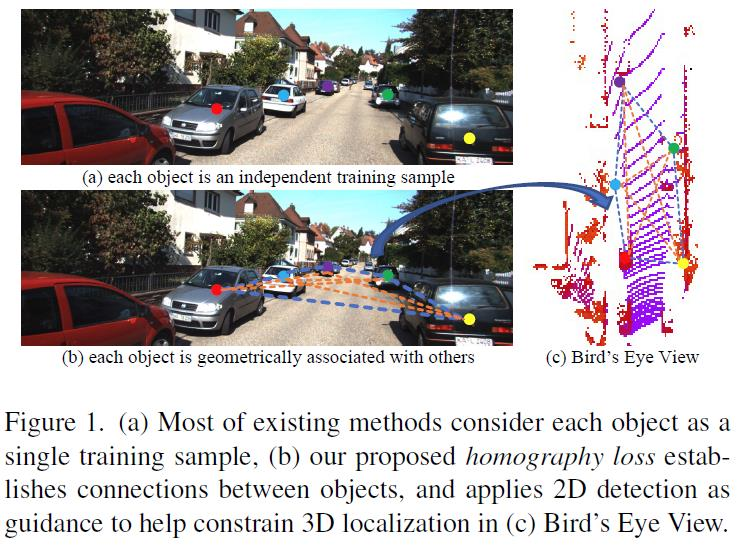
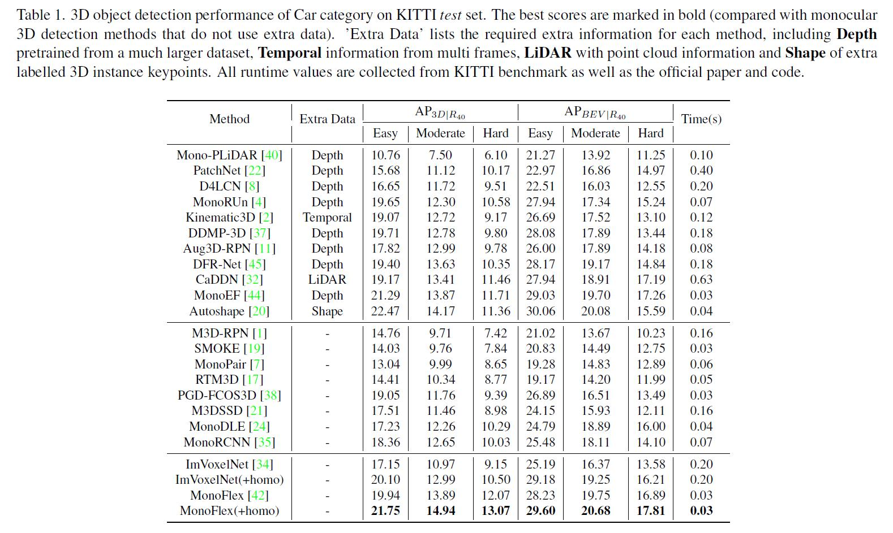

# Homography Loss for Monocular 3D Object Detection. (CVPR 2022)
> This repository hosts the official PyTorch implementation of the paper: "[**Homography Loss for Monocular 3D Object Detection**](https://arxiv.org/abs/2204.00754)".

Authors: [Jiaqi Gu](https://scholar.google.com.hk/citations?user=1Fr1paQAAAAJ&hl=zh-CN)\*, [Bojian Wu](https://scholar.google.com.hk/citations?hl=zh-CN&user=pdx6Lg8AAAAJ), [Lubin Fan](https://scholar.google.com.hk/citations?user=byG_OEIAAAAJ&hl=zh-CN&oi=ao), [Jianqiang Huang](https://scholar.google.com.hk/citations?user=UqAybqgAAAAJ&hl=zh-CN&oi=ao), Shen Cao, [Zhiyu Xiang](https://scholar.google.com.hk/citations?user=mU08eBsAAAAJ&hl=zh-CN&oi=ao), [Xian-sheng Hua](https://scholar.google.com.hk/citations?user=6G-l4o0AAAAJ&hl=zh-CN&oi=ao)

\* Work done primarily while Jiaqi Gu was an intern at Alibaba DAMO Academy.

The code will be coming soon. 

# Abstract
Monocular 3D object detection is an essential task in autonomous driving. However, most current methods consider each 3D object in the scene as an independent training sample, while ignoring their inherent geometric relations, thus inevitably resulting in a lack of leveraging spatial constraints. In this paper, we propose a novel method that takes all the objects into consideration and explores their mutual relationships to help better estimate the 3D boxes. Moreover, since 2D detection is more reliable currently, we also investigate how to use the detected 2D boxes as guidance to globally constrain the optimization of the corresponding predicted 3D boxes. To this end, a differentiable loss function, termed as Homography Loss, is proposed to achieve the goal, which exploits both 2D and 3D information, aiming at balancing the positional relationships between different objects by global constraints, so as to obtain more accurately predicted 3D boxes. Thanks to the concise design, our loss function is universal and can be plugged into any mature monocular 3D detector, while significantly boosting the performance over their baseline. Experiments demonstrate that our method yields the best performance (Nov. 2021) compared with the other state-of-the-arts by a large margin on KITTI 3D datasets.

# Method


# Results


# Citation
If you find our work helpful for your research, please consider citing the following BibTeX entry.
```
@InProceedings{Gu_2022_CVPR,
    title={Homography Loss for Monocular 3D Object Detection},
    author={Gu, Jiaqi and Wu, Bojian and Fan, Lubin and Huang, Jianqiang and Cao, Shen and Xiang, Zhiyu and Hua, Xian-Sheng},
    booktitle = {Proceedings of the IEEE/CVF Conference on Computer Vision and Pattern Recognition (CVPR)},
    month     = {June},
    year      = {2022},
}
```
